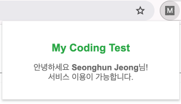

## 🙇🏻 안녕하세요! 공지사항, 업데이트 등을 알려드려요
---

### 📣 서비스 이용 하려면
1. 간단한 소셜 로그인
2. Chrome Web Store 에서 [My Coding Test Connector]() 설치
3. 다음과 같이 로그인 익스텐션과 잘 연결되었는지 확인
   - 

이제 백준에서 문제를 풀면 My Coding Test에서 편하게 복습 가능!

---
### 🛠️ 업데이트
#### 25.01.25
- 서비스 런칭 🎉
---
### 🌏 소통
- google@gmail.com 으로 메일 주셔요.